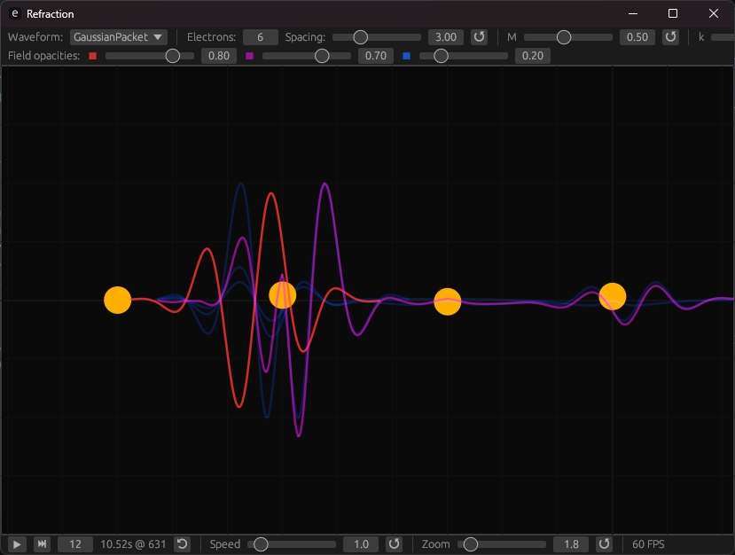
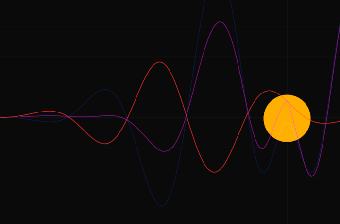

# Forked from <https://github.com/r-preston/refraction> on 2025-08-01

# Refraction

A simulation of the interaction between electromagnetic waves and charged particles, inspired by videos on the topic by [Looking Glass Universe](https://www.youtube.com/watch?v=uo3ds0FVpXs&t=338s) and [3Blue1Brown](https://www.youtube.com/watch?v=KTzGBJPuJwM).

Charged particles are modelled as simple harmonic oscillators that generate an electric field when accelerating, derived from the second time derivative component of the Heaviside-Feynman formula.



# Installation

The application is written in Rust with an egui interface, and is completely cross-platform.

To use, you will need to install Rust. The easiest way is to [install rustup](https://www.rust-lang.org/tools/install), which will set up cargo and rust on your system.

Once Rust is installed, running the command `cargo run` from the same directory as this README will compile and run the application.

# Usage

Refraction has an easy-to-use UI that allows most aspects of the simulation to be modified. For making more advanced changes you'll need to change the source code, see the **Structure** section for tips.

The three groups of controls are as follows:

### Simulation settings


From left to right:

- _Waveform_: options for the shape of the applied wave
- _Electrons_: number of electrons. These are arranged evenly spaced on the $x$ axis, starting at the origin and progressing left
- _Spacing_: distance between neighbouring electrons
- ↺: Reset electron count and spacing to initial value
- $M$: mass of each electron. ↺ resets to intital value
- $k$: spring constant of each electron simple harmonic oscillator. ↺ resets to intital value
- _Damping_: damping factor of each electron simple harmonic oscillator. ↺ resets to intital value

### Visual settings


Modify the opacity of each wave. Red is the initial applied field, blue is the induced field of each electron and purple is the final field resulting from combining the initial and induced fields.

### Simulation controls


From left to right:

- ▶/⏸: play or pause the simulation (context sensitive)
- ⏭ [12]: when paused, step the simulation forward by this number of frames. Number of frames to advance each time is configurable.
- $T$ s @ $N$: Elapsed time and current frame of simulation
- ⟲: Resets the simulation to the beginning in a paused state, without changing any settings.
- _Speed_: Speed of simulation, changing this will change the number of times the simulation updates per second. ↺ resets to 1
- _Zoom_: Zoom level of simulation. Zooming can also be done by scrolling, and clicking and dragging will move the viewpoint . ↺ resets to 1

# Code overview

### Structure

```
main.rs
app.rs
┝ app/canvas.rs
┕ simulation.rs
  ┝ simulation/field.rs
  ┕ simulation/variables.rs
```

- `main.rs` is the entry point for the application and sets the initial window size
- `app.rs` contains all logic relating to the user interface, using thge `egui` crate to draw all UI controls and handle user input
- `canvas.rs` contains a helper struct `Canvas` which enables drawing objects with coordinates and dimensions in simulation space onto the screen.
- `simulation.rs` contains all simulation logic. It contains two structs `Electron` and `Simulation`, as well as definitions for the possible applied waveforms.
- `field.rs` represents a 1D scalar field, used to represent the $y$ component of an electric field at all points in simulation space.
- `variables.rs` contains definitions for all simulation settings. For those controllable in the UI, this includes an initial value as well as a minimum and maximum allowed value.

### Simulation and Electron

The `Simulation` struct holds the applied and resultant fields, and a vector of `Electron`s. Each time `update()` is called it will update the applied field, update all `Electrons` based on the new applied field and then sum up all fields to get the resultant.

A size of a simulation is defined by a range on the $x$ axis, the $y$ axis is considered infinite.

Each `Electron` stores a memory of it's motion for each step of the simulation in order to implement the effect of time delay on the induced field, with a point in space 'seeing' the electron's motion at a time into the past defined by its distance away from the electron.

### Changing settings

To change the initial values for settings when the application starts, or to allow a greater range than the default, simply go to `app/simulation/variables.rs` and modify the `initial`, `min` and `max` values as desired. If you are having performance issues or would like a better resolution, modify `DIVISIONS`.

### Adding new waveforms

To add a new waveform to the UI dropdown, follow these three steps:

1. In `app/simulation.rs`, find the enumeration `pub enum Waveform { ... }` and add a new option to the list.
2. Create a new function definition below this. This should be a function that takes two `f32` parameters ($x$ coordinate and time $t$) and return a single `f32` that is the strength of the field at that point.
3. In the function `fn applied_wave(form: Waveform) -> fn(f32, f32) -> f32 { ... }` located directly below the `Waveform` enum, add the mapping between the enum value you added and the function you just defined.
4. If done right, the project should compile and the new value should appear in the UI dropdown, creating your new wave on the canvas. If unsure at any point, just follow the example of the existing waveform definitions in `simulation.rs`

# Gallery




